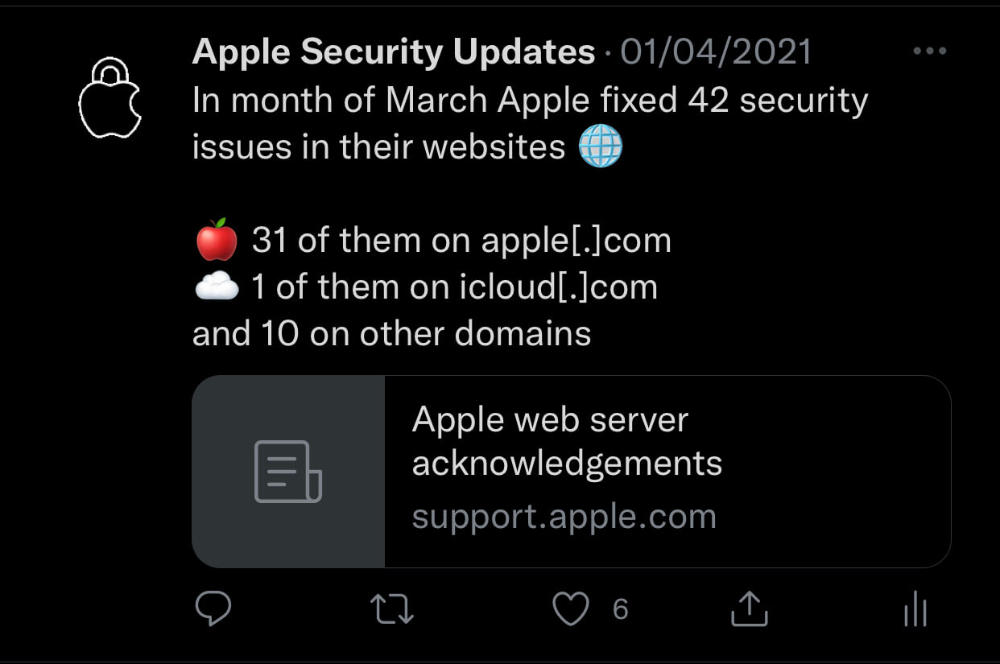

<h1 align="center">ApplSec</h1>
 

<b>Twitter bot written in Python 🐍</b>

<b>Every hour the bot checks for new security updates to Apple's ecosystem 🔐</b>

<b>Running on Twitter account <a href="https://twitter.com/applsec">@ApplSec</a> since February 6, 2021</b>

 

## 🤖 What does the bot tweet?
* 🔄 when new software updates are released,
* 🔒 how many vulnerabilities were fixed in each update,
* 💉 five parts of iOS that got the most security fixes in the latest update,
* ⚠️ if there were any new, or previous zero-day vulnerabilities fixed,
* 🌐 how many security issues Apple fixed on their websites in the previous month,
* 📊 when new major updates are released in September, it tweets how many security issues Apple fixed in previous four series, and how many releases each series had,
* and if Apple updated or added any new entries to previous release notes!
</b>

 

## 🦾 How does the bot work?
Firstly, it creates a current day format and searches for it on the [Apple security updates](https://support.apple.com/en-us/HT201222) page. If a new update is available, it starts gathering data from the release notes. The bot counts how many security issues were fixed in each release, checks for zero-days and much more.

If release notes are not available at the beginning, the bot saves the release and tweets info when they are available. Each time the bot also takes last 20 release notes and checks if Apple added or updated any entries.

Because the bot is running every hour, it is saving all of the tweets and info it tweeted that day to avoid tweeting the same thing twice.

### How does the bot interact with Twitter?
The bot is using a Python library [Tweepy](https://www.tweepy.org/), which enables communication between the bot and Twitter.

### Where does the bot run?
I am using a website called [PythonAnywhere](https://www.pythonanywhere.com/). PythonAnywhere has a feature called Tasks, which enables you to upload your Python code and set the time when you want to run it.

 

## 😇 Got any ideas?
The bot is often updated as new ideas appear - and new issues as the bot is using regex to grab information.
  

*Apple, Apple logo, iCloud, watchOS, tvOS and macOS are trademarks of Apple Inc., registered in the U.S. and other countries and regions.*
