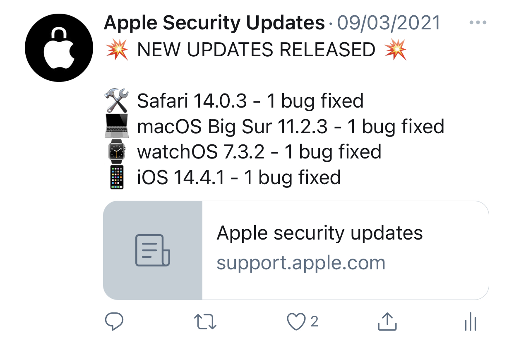
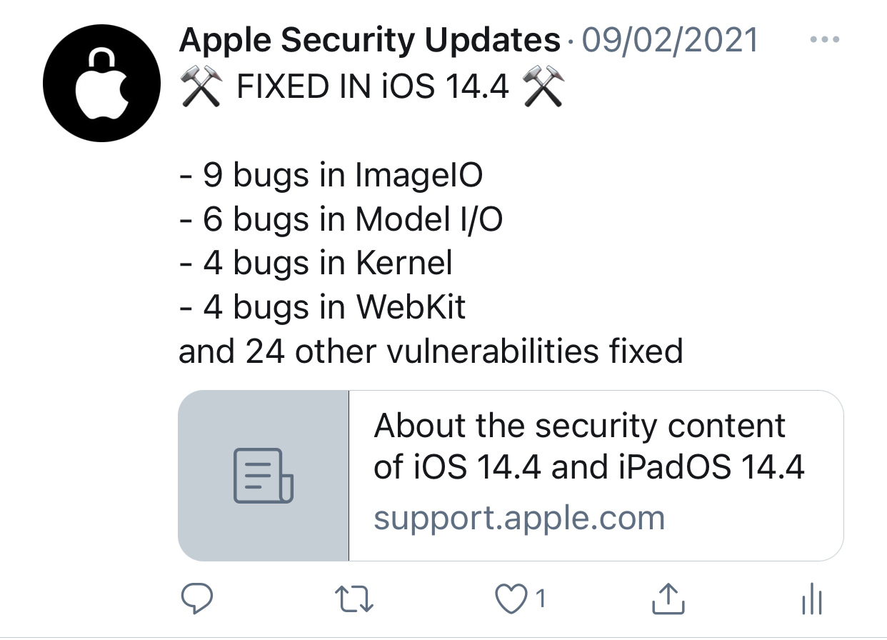
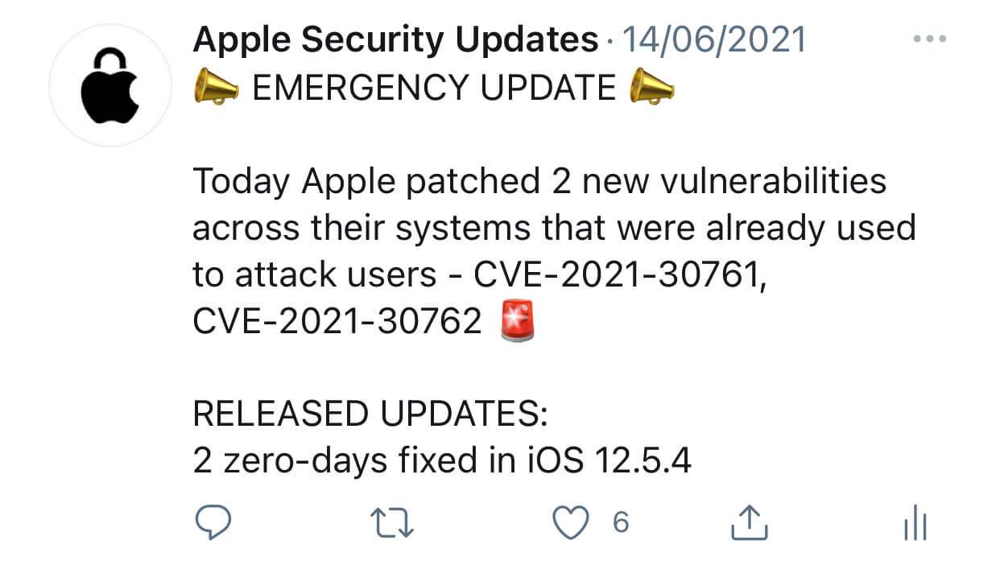
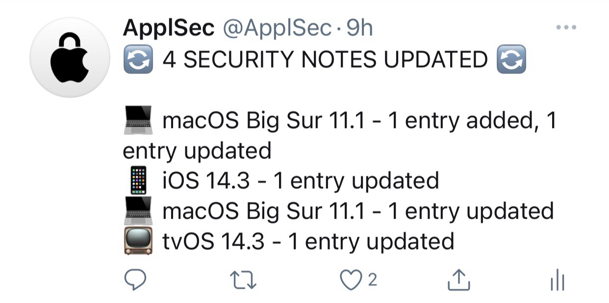

<h1 align="center">ApplSec</h1>
 

<b>Twitter bot written in Python 🐍</b>

<b>Every day the bot checks for new updates to Apple's operating systems 🔐</b>

<b>Running on Twitter account @ApplSec since February 6, 2021</b>

<b>The bot tweets:
* 🔄 which updates were released,
* 🔒 how many vulnerabilities were fixed in each update,
* 💉 top five parts of the system that got the most fixes in the latest iOS update,
* ⚠️ if there were any zero-day vulnerabilities patched,
* and if Apple updated or added any new entries to previous release notes!
</b>
 

## 🤖 How does the bot work?
When executed, it checks the [Apple security updates](https://support.apple.com/en-us/HT201222) page if any new updates were released to their ecosystem that day. The bot creates a current day format and searches for it on the page. If it finds any new updates, it will save the number of the updates. If Apple released security release notes, it grabs the link to the release notes and gathers information like the title, so it knows which update it is and it counts how many security vulnerabilities were fixed. If the update has no security release notes, it will just grab the title and add it to the list of new updates. Depending on the system that got the update, it will assign an emoji to the title. It also checks if any zero-day vulnerabilities were patched and it will separately tweet where and how many were fixed. Each time the bot also checks last 20 security release notes, if Apple updated or added any new entries in previous release notes.

### How does the bot interact with Twitter?
The bot is using a Python library called __Tweepy__, which enables communication between Python code and Twitter API. You can find more about Tweepy on their [official page](https://www.tweepy.org/) or on their [GitHub repository](https://github.com/tweepy/tweepy).

### How does the bot run automatically every day?
Currently I am using a website called __PythonAnywhere__. PythonAnywhere has a feature called Tasks, which enables you to upload your Python code and set the time when you want to run it. You can find more about PythonAnywhere on their [official page](https://www.pythonanywhere.com/).

 

## 😇 Got any ideas?
The bot is often updated as new ideas appear - and new issues of course :) If you have any ideas, feel free to message me.
