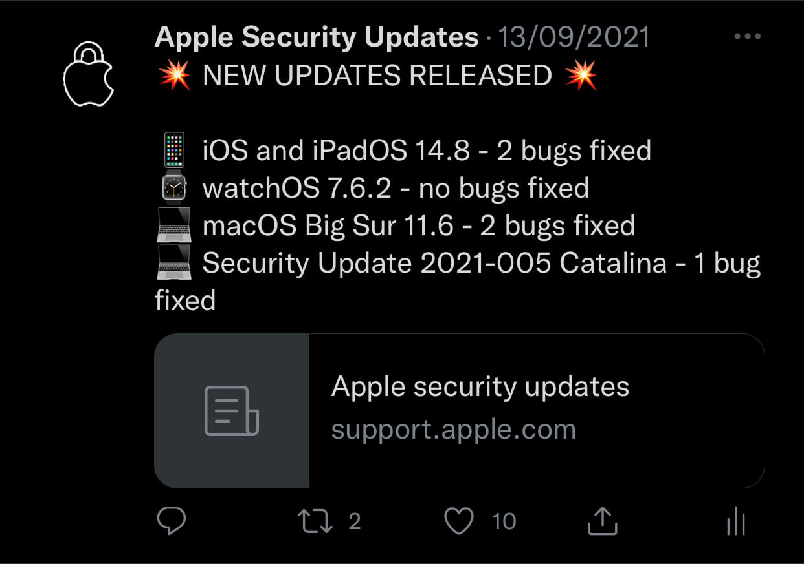
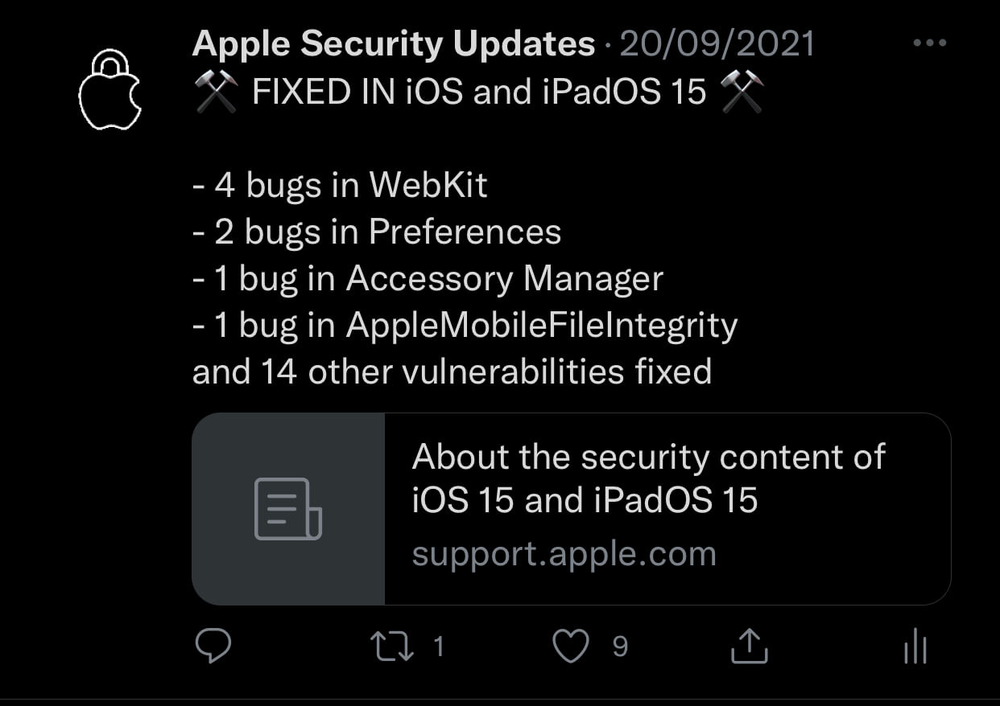
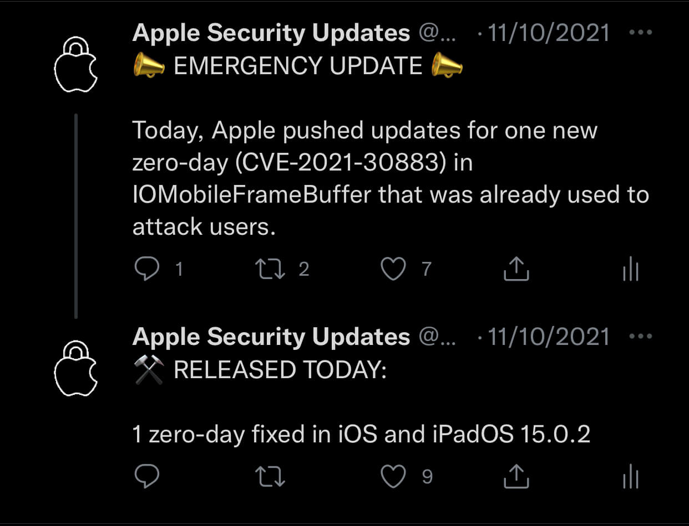
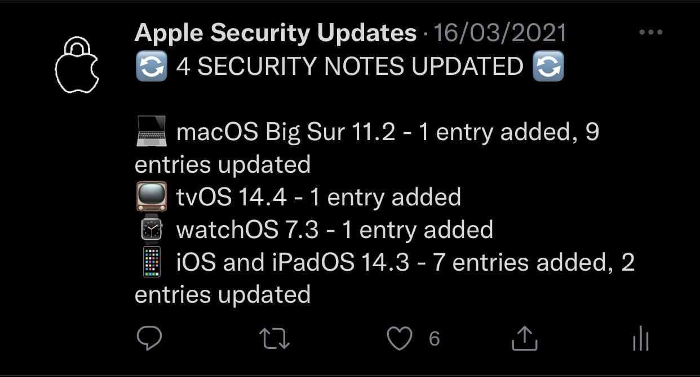

<h1 align="center">ApplSec</h1>
 

<b>Twitter and Mastodon bot written in Python 🐍</b>

<b>Hourly checking for the latest updates to Apple's ecosystem 🔐</b>

 

<b>Running on <a href="https://twitter.com/ApplSec">@ApplSec</a> since February 6, 2021</b>

<b>Running on <a href="https://mastodon.social/@applsec">@applsec@mastodon.social</a> since November 5, 2022</b>

## Posting the following info:

- 💥 when new updates are made available,
- 🔒 how many vulnerabilities Apple fixed in each update,
- 💉 four iOS modules that got the most security fixes in the latest update,
- ⚠️ if fixes for any new, or previous zero-day vulnerabilities were released,
- 🔄 if Apple updated or added any new entries to previous security notes,
- and more!

## 🦾 How does it work?

First, it creates a current day format and searches for it on the [Apple Security Updates](https://support.apple.com/en-us/HT201222) page. If any new updates are found, it starts gathering data from their security notes, counts how many security issues were fixed, checks for zero-days and other information. Then it arranges the gathered data into one post or a thread as needed.

If Apple says "no details yet", it will save the name of the release and post that info is not available yet. It will continue to check and post again when security content becomes available with all of the information it contains.

The bot is checking for changes every hour. To avoid posting the same thing, it is saving posted data for the current day in a JSON file. Alongside of it, it saves 10 last zero-days, to be able to recognize if a zero-day is new or if it is a previous zero-day but in an update for another platform.

At the start of the day, it checks if Apple updated any old security notes on the previous day. On January 19th, 2022 Apple updated 25 of them, adding and updating entries all the way back to security notes from two years ago.

 

## Thanks to:

- [Tweepy](https://github.com/tweepy/tweepy), for communication with Twitter API
- [requests](https://github.com/psf/requests), for communication with Mastodon API and to request Apple's website
- [lxml](https://github.com/lxml/lxml), for easier HTML processing
- [emoji](https://github.com/carpedm20/emoji), for outputting emojis
- [PythonAnywhere](https://www.pythonanywhere.com/), service used for hourly running the bot

 

The bot is often updated as new ideas appear and to keep up with changes to Apple's website.

 

_Apple, Apple logo, iCloud, watchOS, tvOS and macOS are trademarks of Apple Inc., registered in the U.S. and other countries and regions._
