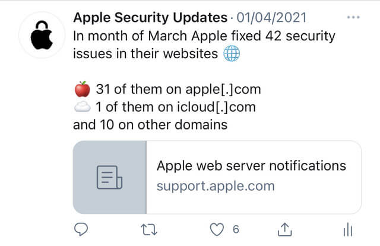

<h1 align="center">ApplSec</h1>
 

<b>Twitter bot written in Python 🐍</b>

<b>Every day the bot checks for new security updates to Apple's ecosystem 🔐</b>

<b>Running on Twitter account @ApplSec since February 6, 2021</b>

<b>The bot tweets:
* 🔄 when new software updates are released,
* 🔒 how many vulnerabilities were fixed in each update,
* 💉 five parts of the system that got the most security fixes in the latest iOS update,
* ⚠️ if there were any zero-day vulnerabilities fixed,
* 🌐 how many security issues Apple fixed on their websites in the previous month,
* 📊 when new iOS series starts in September, it tweets how many bugs Apple fixed in previous four iOS series,
* and if Apple updated or added any new entries to previous release notes!
</b>
 

## 🤖 How does the bot work?
When executed, it creates a current day format and searches for it on the [Apple security updates](https://support.apple.com/en-us/HT201222) page. If any new update is released, it grabs that whole row from the page and saves it. All new rows are then sent to the function which grabs the release notes link if there is one and grabs all the data from the release notes like the title. It then counts how many security fixes there are, checks for any zero-day fixes and adds an emoji depending on the part that got the update. If the update has no release notes, it grabs the title from the row and saves it. When all data is gathered it tweets that new updates were released today with the number of security fixes in them. If there is a a new iOS update, it gathers all the parts and tweets five parts with the most security bugs fixed. Each time the bot also takes first 20 release notes and checks if Apple added any new entries or updated any previous ones.

Since version 8.0 the bot was extended to Apple's websites. On the first day of the month bot checks the [Apple web server notifications](https://support.apple.com/en-us/HT201536) page, counts how many issues Apple fixed in the previous month, how many of those were on _apple.com_ and how of those on _icloud.com_. In version 9.0 an interesting statistic tweet was added set to be tweeted in September when a new iOS series starts. At that time a function is ran which determines the version of previous four iOS series and then goes again to Apple security update page to gather some data. For example it gathers all the updates that iOS 14 got and counts all the security fixes in each update. It does this for previous four iOS series and tweets it.

### How does the bot interact with Twitter?
The bot is using a Python library called __Tweepy__, which enables communication between Python code and Twitter API. You can find more about Tweepy on their [official page](https://www.tweepy.org/) or on their [GitHub repository](https://github.com/tweepy/tweepy).

### How does the bot run automatically every day?
Currently I am using a website called __PythonAnywhere__. PythonAnywhere has a feature called Tasks, which enables you to upload your Python code and set the time when you want it to be executed. You can find more about PythonAnywhere on their [official page](https://www.pythonanywhere.com/).

 

## 😇 Got any ideas?
The bot is often updated as new ideas appear - and new issues of course :) If you have any ideas, feel free to message me.
