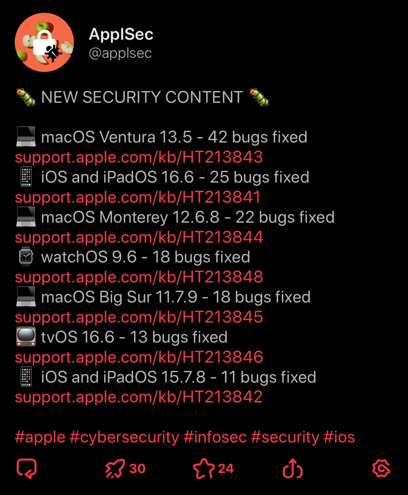
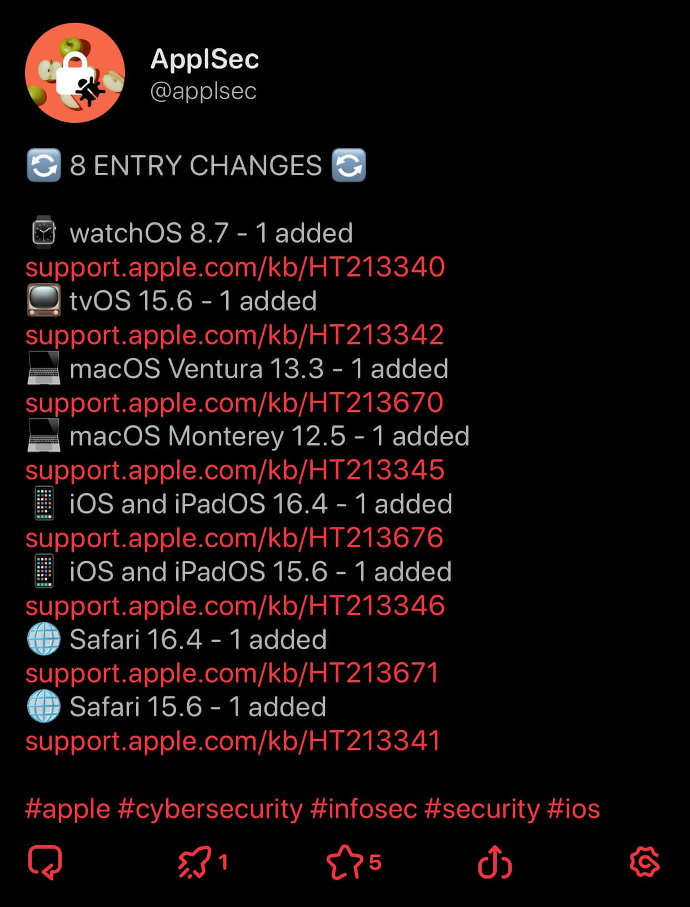

<h1 align="center">ApplSec</h1>

 

<b>Refreshing Apple Security Page, so you don't have to! 🍎 🔐</b>

<b>On Twitter 🐥 <a href="https://twitter.com/applsec">@applsec</a> since February 6, 2021</b>

<b>On Mastodon 🐘 <a href="https://infosec.exchange/@applsec">@applsec@infosec.exchange</a> since November 5, 2022</b>

<b>On Bluesky 🦋 <a href="https://bsky.app/profile/applsec.bsky.social">@applsec.bsky.social</a> since December 10, 2024</b>

 

## 📣 What does it post?

 

## 🦾 How does it work?

The bot starts by checking the [Apple Security Updates](https://support.apple.com/en-us/100100) page for new releases. It visits their security content pages while gathering how many security issues (CVEs) were fixed in each release, checking for zero-days, and more.

If Apple says "no details yet", it will save the release internally and post that information is not available yet. It will continue to check any pending releases and make the post when security content is available with the information it contains.

To stay up to date with beta cycles, the bot is checking the RSS feed of the [Apple Developer Releases](https://developer.apple.com/news/releases) page.

Once the new releases are gathered, it arranges their data into a post or a thread as needed and sends it to the respective social media API.

The bot is checking for changes regularly, almost hourly. It stores posted releases internally, so it can avoid and ignore them. This internal system contains the last few zero-days as well, so it can recognize when a zero-day is new or if it's just an additional update for a different operating system.

Every midnight, the bot scans previous security content pages to find any added or updated entries since the original posting. For example, on January 19th, 2022, Apple modified 25 of such pages, adding and updating entries on releases all the way back to two years ago.

The bot is frequently updated as new ideas appear and to keep up with any changes to Apple's website.

 

## ✨ Acknowledgements

- __[requests](https://github.com/psf/requests)__, for communication with Twitter/Mastodon/Bluesky API and for requests to Apple's website
- __[lxml](https://github.com/lxml/lxml)__, for simplified HTML processing
- __GitHub Actions__, for running the bot ❤️

 

_Not affiliated with Apple Inc._

_Apple, iCloud, watchOS, tvOS and macOS are trademarks of Apple Inc., registered in the U.S. and other countries and regions._
