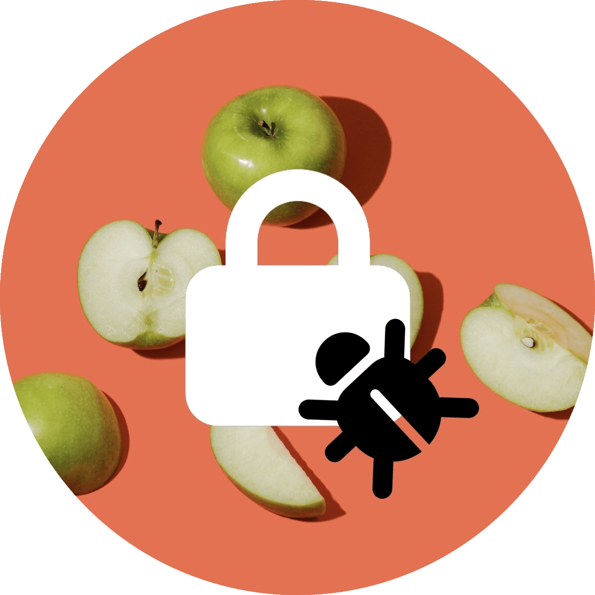

<h1 align="center">ApplSec</h1>
 

<b>Twitter bot written in Python 🐍</b>

<b>Checking for the latest updates to Apple's ecosystem every hour 🔐</b>

<b>Running on <a href="https://twitter.com/applsec">@ApplSec</a> since February 6, 2021</b>

## Keeps you up to date with the following info:
* 💥 latest software updates,
* 🔒 how many vulnerabilities Apple fixed in each update,
* 💉 five iOS parts that got the most security fixes in the latest update,
* ⚠️ fixes for any new, or previous zero-day vulnerabilities,
* 🌐 how many security issues Apple fixed on their websites each month,
* 🔄 if Apple updated or added any new entries to previous release notes,
* and more!

## 🦾 How does it work?
First, it creates a current day format and searches for it on the [Apple Security Updates](https://support.apple.com/en-us/HT201222) page. If a new update is available, it starts gathering data from the release notes. It counts how many security issues were fixed in each release, checks for zero-days and other needed data.

If release notes are not available at the beginning, it will save the release and tweet that info is not available yet. Next time it will check for it and tweet that release notes are now available. Each time it also takes the last 20 release notes and checks if Apple added or updated any entries.

As it is checking every hour, it is saving all of the tweeted info for the current day to avoid tweeting the same thing twice.

For communication with Twitter I am using Python library [Tweepy](https://www.tweepy.org/), and for running the bot a Tasks feature on the [PythonAnywhere](https://www.pythonanywhere.com/) website, which allows you to set how often you want to run your code.

The bot is often updated as new ideas appear and to keep with changes to Apple's website.

 

*Apple, Apple logo, iCloud, watchOS, tvOS and macOS are trademarks of Apple Inc., registered in the U.S. and other countries and regions.*
