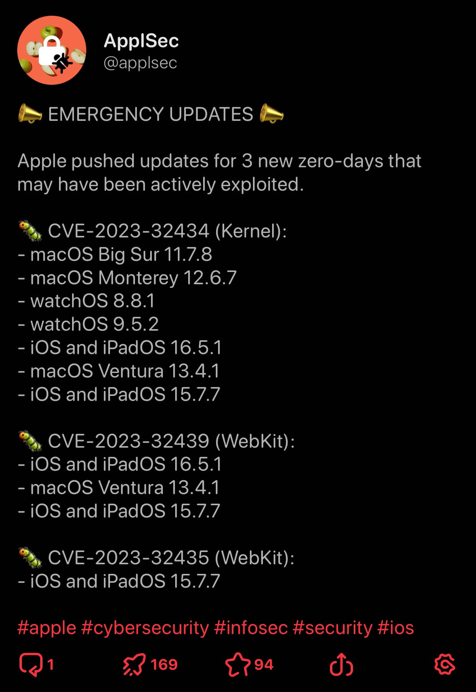
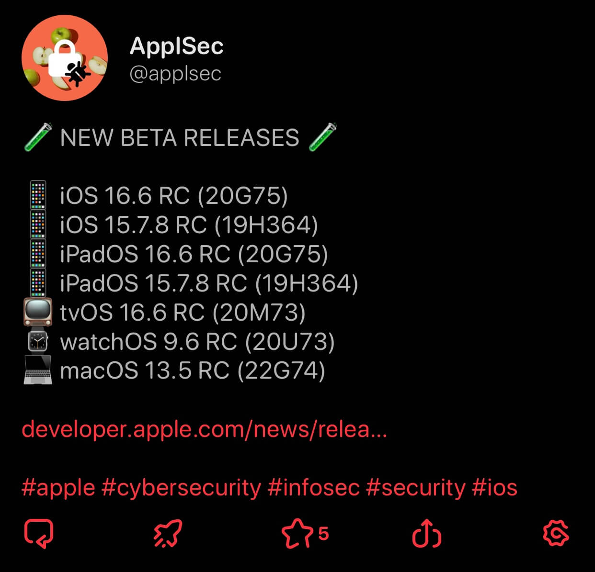

<h1 align="center">ApplSec</h1>

 

<b>Python bot ğŸ refreshing Apple's Security Page for you ğŸ 🔐</b>

<b>Running on 🥠<a href="https://twitter.com/ApplSec">@ApplSec</a> since February 6, 2021</b>

<b>Running on 😠<a href="https://mastodon.social/@ApplSec">@ApplSec@mastodon.social</a> since November 5, 2022</b>

 

## 📣 What does it post?

 

## 🦾 How does it work?

It starts by checking if the latest release on [Apple Security Updates](https://support.apple.com/en-us/HT201222) page was made available today. If yes, it continues to check the next release. When it gathers all new releases, it starts visiting their security content pages. There it counts how many security issues (CVEs) were fixed, checks for zero-days, etc.

If Apple says "no details yet", it will save the release's name and say in the post that information is not available yet. It will continue to check and make a post when security content is available with all the information it contains.

In the end, it arranges the gathered data into a post or a thread as needed and sends it to Twitter and Mastodon.

The bot is checking for changes every hour. In order to avoid posting and checking the same thing twice, it stores recently posted data in a JSON file. The file also contains ten last zero-days, so it can tell if a zero-day is new or if it's just an additional update for another platform.

At midnight, the bot checks if Apple has updated or added any entries to older security notes. On January 19th, 2022, Apple updated 25 security notes, adding and updating entries back to releases from two years ago.

 

The bot is often updated as new ideas appear and to keep up with any changes to Apple's website.

 

## ✨ Acknowledgements

- __[Tweepy](https://github.com/tweepy/tweepy)__, for communication with Twitter API
- __[requests](https://github.com/psf/requests)__, for communication with Mastodon API and for requests to Apple's website
- __[lxml](https://github.com/lxml/lxml)__, for easier HTML processing and to not rely on regex too much
- __GitHub Actions__, which I am using for tests and for hourly running the bot

 

_Apple, Apple logo, iCloud, watchOS, tvOS and macOS are trademarks of Apple Inc., registered in the U.S. and other countries and regions._
